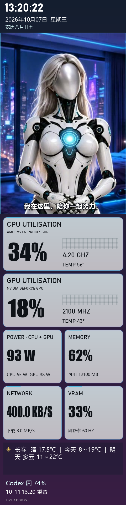

# AuxDash

Windows x64 原生副屏仪表盘与机器人陪伴软件。人物动画在本机播放，程序以托盘方式独立运行，关闭 Codex 后仍可使用。

## 下载与启动

前往 [Releases](https://github.com/Wastrix-ba2ia/AuxDash/releases/latest)，下载 **AuxDash-v0.3.0-windows-x64-full.zip**。完整解压到可写目录，再运行 **副屏监控.exe**。

完整包默认包含人物、卧室背景、待机及全部已完成的动作素材。无需视频生成 API，也不用额外下载动画。GitHub 的 Source code 压缩包只含源码；自行构建时可使用自选图片，或从完整包复制媒体目录。

要求 Windows x64、.NET Framework 4.8。首次启动默认横版、不翻转；Codex 联动和自动内存清理默认关闭。

## 界面预览

下图使用演示参数展示布局；实际数值由本机硬件读取。





## 屏幕与布局

右键托盘机器人图标：

- **显示布局**：横版 1920×480 或竖版 480×1920，选择自动保存。
- **画面翻转 180°（倒装屏幕）**：人物、字幕和仪表盘一起旋转，横竖版均支持。
- **移动到显示器**：换电脑后重新选择屏幕；原屏幕不存在时使用其他副屏或主屏。
- **全屏 / 窗口**：F11 切换，Esc 退出全屏，窗口模式可拖动。
- **开机启动**：为当前 Windows 用户开启或关闭启动项。

竖屏全屏使用前，在 Windows 显示设置里将目标屏幕设为纵向。竖版按比例缩放；横向屏幕预览竖版时会有侧边空白。

程序通过 Windows 任务计划程序独立运行。启动失败时会提示，可从文件资源管理器直接运行 EXE。Ctrl+Q 或托盘“退出”关闭程序。

## 硬件、天气与提醒

显示 CPU/GPU 使用率、频率、温度、CPU+GPU 功耗、内存、显存、网络上传速度、日期、星期和农历。托盘“天气地区”支持搜索城市或区县，显示天气图标、当前温度和预报；临时离线时显示缓存。

CPU 温度及功耗依赖兼容的 LibreHardwareMonitor/PawnIO 环境及权限；GPU 信息也取决于硬件和驱动。无法读取的数值显示“—”。**POWER 是 CPU+GPU 合计，并非插座整机功耗。**

可开启每工作一小时提醒眼睛休息五分钟。内存超过 80% 持续 30 秒时，可选回收符合条件的最小化应用工作集，每 10 分钟最多一次；工作集下降不等于实际释放相同容量，应用恢复时可能重新加载数据。完整包默认关闭自动清理。

## 人物动画

本机状态、提醒、游戏和音乐可触发动作；托盘“机器人动作”可手动预览已安装的素材。待机动作随机切换，字幕随状态变化。屏幕关闭后恢复时可播放唤醒动作。

播放器将各类帧统一到 736×486 的显示画布。动作结束时淡回固定待机首帧，再继续待机动画，以减少尺寸跳变。待机还带有核心呼吸光；素材本身的姿势与生成误差仍可能影响衔接。

## Codex / PUBG 绑定

右键托盘 → **绑定设置 · Codex / PUBG…**。

- **Codex**：先在官方客户端登录，再开启本机联动。数据目录留空时自动查找 CODEX_HOME 或用户目录的 .codex；需要时指定 codex.exe。无需填 OpenAI 密码或 API 密钥。
- 周额度通过本机 app-server 读取，工作状态从本机 sessions 事件判断。工作、等待、完成或报错时切换动作与字幕；读取失败时回到本机模式，旧额度会标记。接口适配可能随 Codex 版本变化，并非所有任务事件都能识别。
- **PUBG**：填写 PUBG 游戏内昵称；Steam 显示昵称可能不同。仅保存昵称即可使用本机进程检测和陪伴动作。
- 官方玩家验证需自己的 [PUBG API 密钥](https://developer.pubg.com/)，使用当前 Windows 用户 DPAPI 加密保存。进入 PUBG 暂停音乐动作并播放已安装的战术动画；未实现实时击杀或吃鸡事件接口。

## 音乐联动

读取 Windows 媒体会话提供的类型与播放状态；系统标记为音乐且持续播放时触发动作。暂停、会议、重要提醒或 PUBG 运行时停止音乐动作。

不录音、不采集系统音频，无法识别节奏、流派或是否有人声。播放器没有提供媒体类型时可能不触发。

## 构建

Windows PowerShell：

```powershell
.\build.ps1 -SkipSensorBridge
.\副屏监控.exe
```

构建会生成缺失的占位背景和图标。F2 可选择自己的图片。完整包包含传感器组件；自行构建传感器桥接程序时需要相应的 LibreHardwareMonitor 库。媒体会话桥接程序使用 Windows WinRT 元数据。

## 隐私与许可

每位用户绑定自己的账户。公开版不包含维护者的账户、个人设置、接口密钥、生成任务记录或业务集成。不要提交 auth.json、bindings.xml、pubg-profile.xml、缓存和诊断日志。

联网功能包括 Open-Meteo 天气、PUBG 官方验证和通过本机客户端读取 Codex 额度。人物播放不会调用视频生成服务。

源码使用 MIT 许可证；人物图片、视频、品牌标识与第三方组件不自动由 MIT 覆盖，详见 [THIRD_PARTY.md](THIRD_PARTY.md)。本项目与 OpenAI、PUBG 无官方隶属关系。
