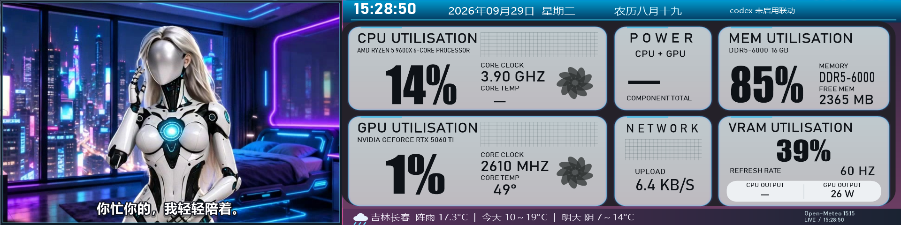
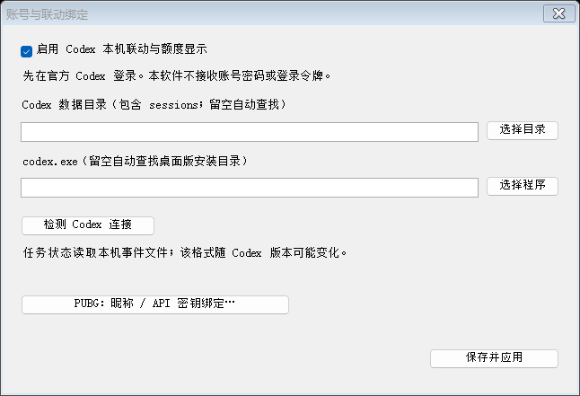

# AuxDash

Windows x64 原生 WinForms 副屏仪表盘，推荐 1920×480。托盘运行，不依赖 Codex 启动。

## 界面预览





## 下载完整运行版

前往 [Releases](https://github.com/Wastrix-ba2ia/AuxDash/releases/latest)，下载 **AuxDash-v0.2.0-windows-x64-full.zip**，完整解压后运行“副屏监控.exe”。

完整包默认包含所有审核完成的人物待机、日常、音乐、PUBG 与硬件状态动画素材，共49组；不需要另找素材或使用视频生成 API。以后发布的完整运行版也会默认包含人物动画。GitHub 自动生成的 Source code 压缩包只有源码，不含视频帧。

托盘菜单支持选择天气地区、开机启动、副屏位置、动画动作与音乐联动。PUBG 运行时会停止音乐动作。每位用户自行绑定 Codex / PUBG。Codex 联动和自动内存清理默认关闭。

## 构建源码

Windows x64、.NET Framework 4.8，PowerShell 执行：

```powershell
.\build.ps1 -SkipSensorBridge
.\副屏监控.exe
```

源码 ZIP 不含人物媒体或第三方传感器二进制；完整运行包内置人物素材。

## Codex / PUBG 绑定

右键托盘 → **绑定设置 · Codex / PUBG…**。

- Codex：先在官方客户端登录。数据目录留空时按 CODEX_HOME 或用户目录的 .codex 查找；需要时手动指定 codex.exe。不要求 OpenAI 密码或令牌。
- 额度通过本机 app-server 读取；动作联动解析本地 sessions 事件，可能随 Codex 更新变化。
- PUBG：填写游戏内昵称；官方验证需个人 PUBG API 密钥，使用当前 Windows 用户 DPAPI 加密。仅保存昵称也能检测本地游戏进程。

## 仪表盘和宠物

显示 CPU / GPU / 内存 / 显存 / 网络、日期农历与天气。托盘“天气地区”可搜索并选择城市或区县。天气通过 Open-Meteo 获取。CPU 温度与功耗可能需要兼容的 LibreHardwareMonitor / PawnIO 环境及权限；POWER 为 CPU+GPU 合计，不是插座整机功耗。

音乐联动只读取 Windows 媒体会话提供的播放类型与状态，不采集音频。系统标记为音乐并持续播放时随机触发动作；暂停后回到待机。PUBG 进程启动时联动暂停。暂不区分音乐风格、节奏或人声。

自动内存清理可在托盘关闭：超过80%持续30秒，尝试回收符合条件的最小化应用工作集，每10分钟最多一次。工作集减少不等于系统实际释放量。

## 隐私与许可

任务事件在本机读取，不上传聊天内容。联网用于天气、Codex 额度、PUBG 验证和媒体接口。不要上传设置、绑定、密钥、缓存或诊断日志。

源码使用 MIT 许可证。人物视频和图片素材随完整运行包提供，不由源码 MIT 许可证覆盖。第三方组件和媒体说明见 [THIRD_PARTY.md](THIRD_PARTY.md)。

本项目与 OpenAI、PUBG 无官方隶属关系。
